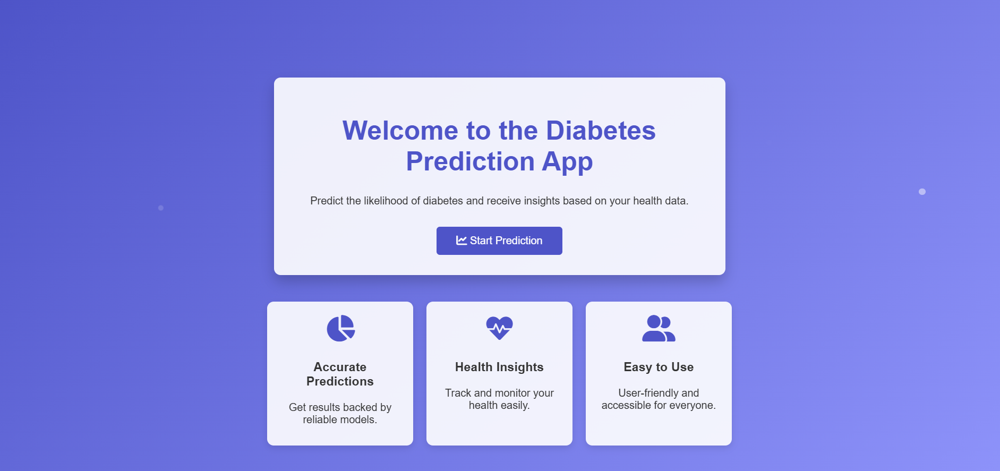
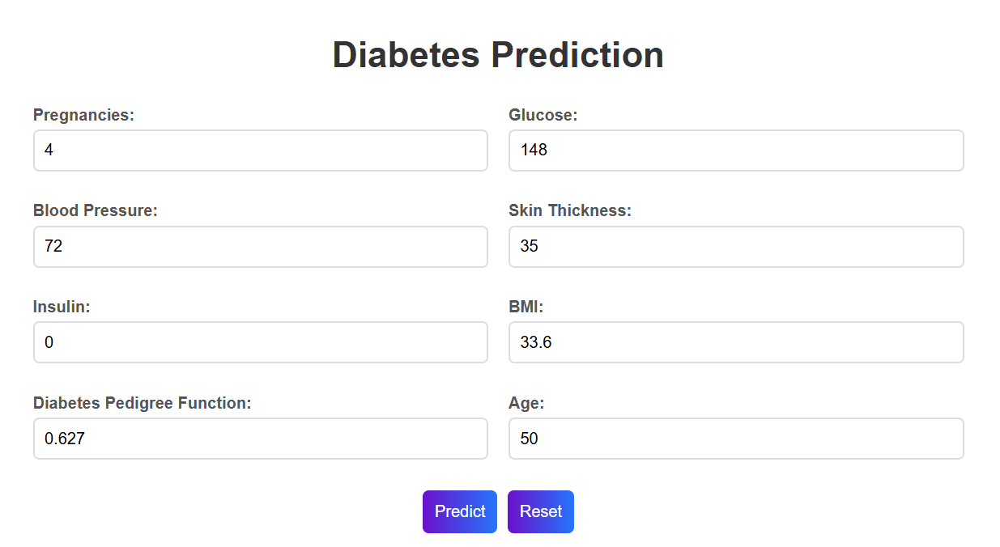
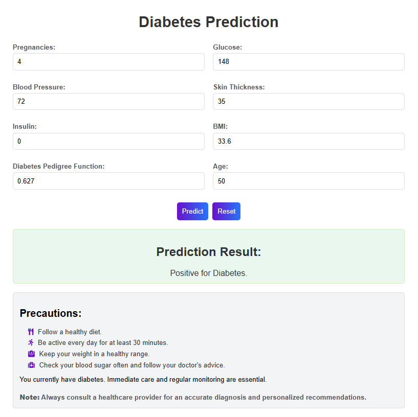
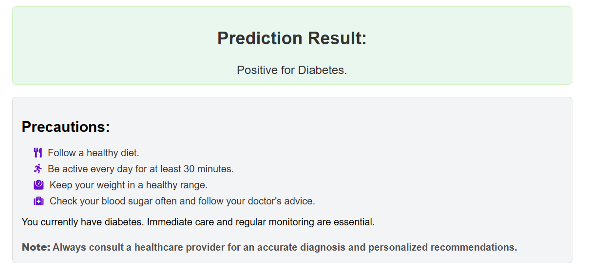

# 🧠 Diabetes Prediction System

A production-ready Machine Learning web application that predicts whether a person is diabetic or not based on medical attributes. The system is built using a trained model on the PIMA Indians Diabetes Dataset and deployed through a Flask-based web interface.

---

## 🌐 Live Demo

🚀 *Coming Soon... (Will be deployed on Render)*

---

## 📸 Application Screenshots

### 🏠 Home Page



---

### 📝 Prediction Form



---

### 📊 Prediction Result



---

### ⚠️ Health Precautions



---

## 🚀 Project Overview

The Diabetes Prediction System leverages supervised machine learning algorithms to analyze patient health data and provide real-time predictions. It helps in early detection of diabetes risk, making it useful for healthcare awareness and preliminary diagnosis.

---

## 🎯 Key Features

* ✅ User-friendly web interface (Flask + HTML)
* ✅ Real-time diabetes prediction
* ✅ Pre-trained ML model integration
* ✅ Data preprocessing with scaling
* ✅ Multiple model experimentation (Random Forest, Gradient Boosting, etc.)
* ✅ Clean and modular project structure

---

## 🛠️ Tech Stack

* **Programming Language:** Python
* **Framework:** Flask
* * **Machine Learning:** Scikit-learn
* **Libraries:** Pandas, NumPy, Joblib
* **Frontend:** HTML, CSS
* **Dataset:** PIMA Indians Diabetes Dataset

---

## 📊 Dataset Information

The model is trained on the **PIMA Indians Diabetes Dataset**, which includes medical predictor variables such as:

* Pregnancies
* Glucose Level
* Blood Pressure
* Skin Thickness
* Insulin Level
* BMI (Body Mass Index)
* Diabetes Pedigree Function
* Age

---

## ⚙️ How It Works

1. User enters medical details via web form
2. Data is processed and scaled using a pre-trained scaler
3. Input is passed to the trained ML model
4. Model predicts diabetes status
5. Result is displayed on the web interface

---

## ▶️ Run Locally

### 1. Clone the Repository

```bash
git clone https://github.com/Yougeshkumar/Diabetes-Prediction-System.git
cd Diabetes-Prediction-System
```

### 2. Create Virtual Environment

```bash
python -m venv venv
venv\Scripts\activate
```

### 3. Install Dependencies

```bash
pip install -r requirements.txt
```

### 4. Run the Application

```bash
python app.py
```

### 5. Open in Browser

```
http://127.0.0.1:5000/
```

---

## 📁 Project Structure

```
Diabetes_Prediction/
│
├── app.py
├── train_model.py
├── requirements.txt
├── README.md
│
├── images/
├── models/
├── templates/
├── static/
```

---

## 📈 Future Enhancements

* 🔹 Deploy on cloud (Render / AWS / Azure)
* 🔹 Add user authentication system
* 🔹 Improve UI/UX with React
* 🔹 Integrate real-time health APIs
* 🔹 Model optimization and accuracy improvements

---

## 👨‍💻 Author

**Yougesh Kumar**
B.Tech CSE | Machine Learning Enthusiast

---

## ⭐ Acknowledgements

* PIMA Indians Diabetes Dataset
* Scikit-learn Documentation
* Open-source ML community

---

## 📌 Conclusion

This project demonstrates the practical implementation of machine learning in healthcare, combining data science and web development to create an impactful real-world application.

---
